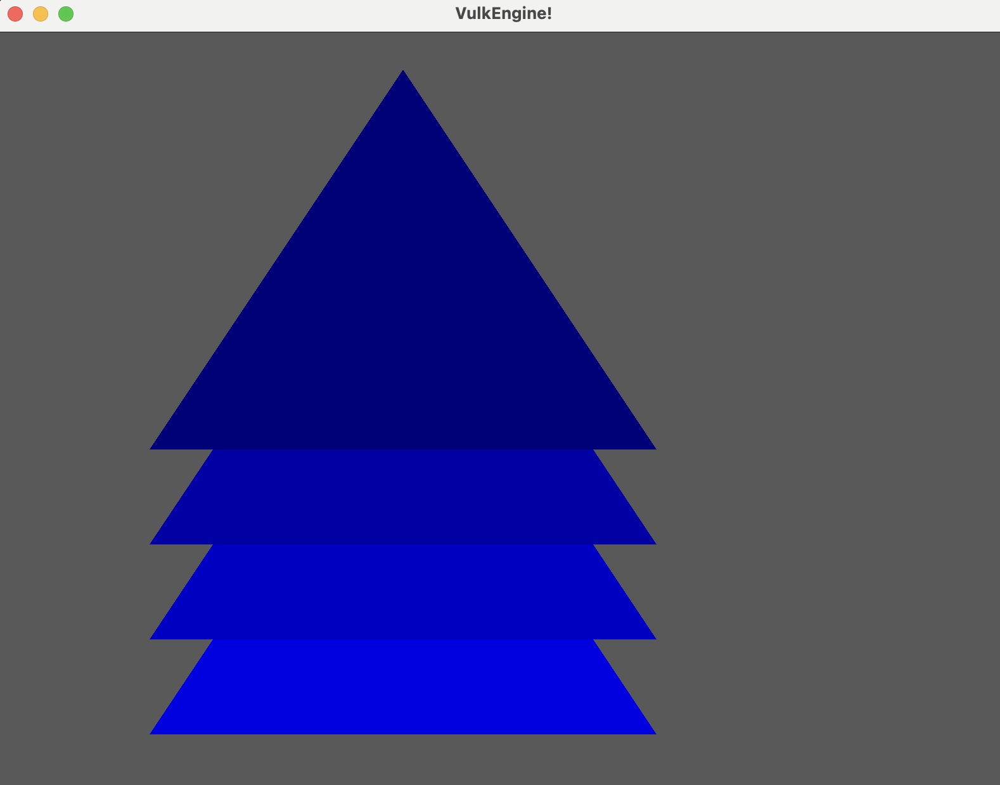
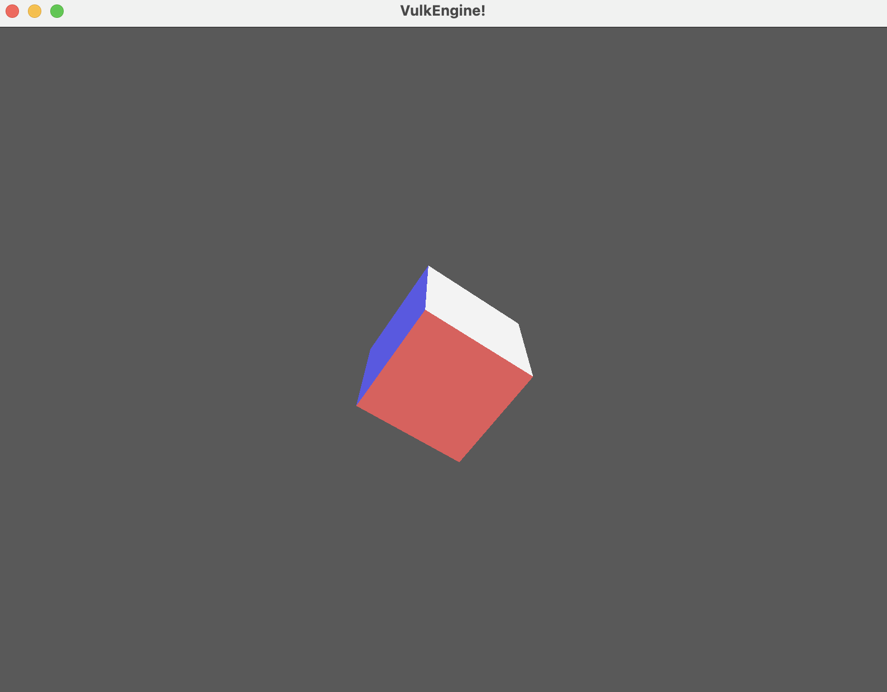
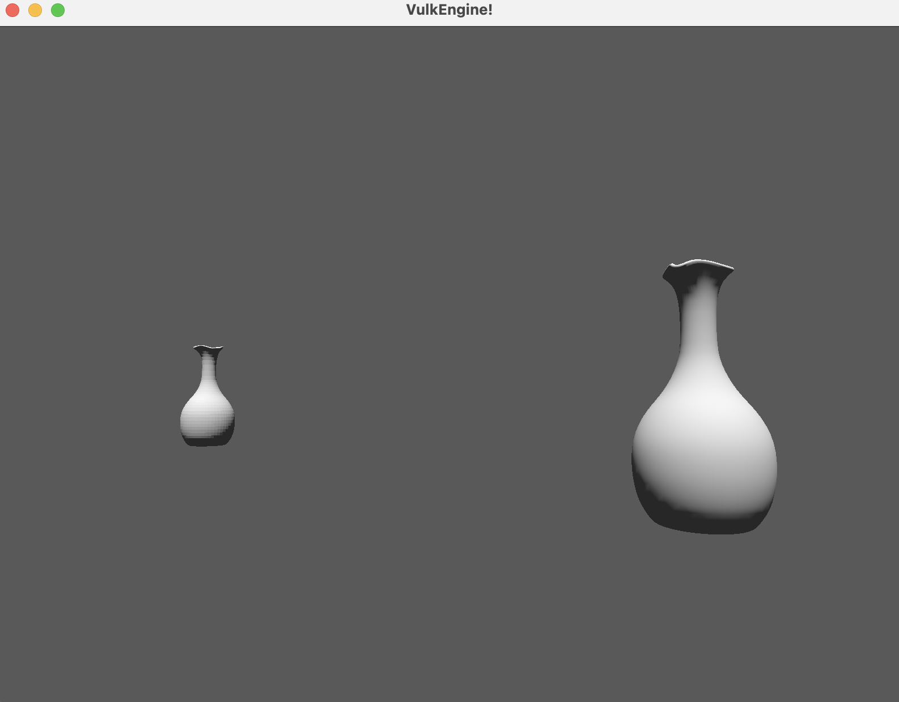
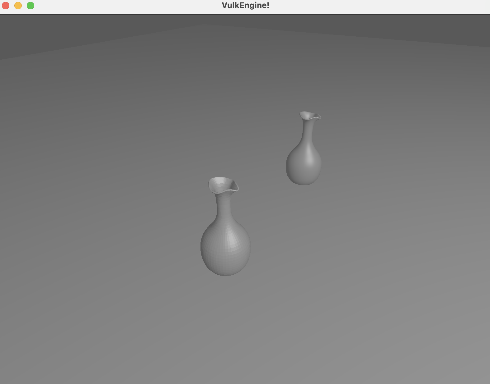

# VulkRenderer
I

+ **Developed a custom Vulkan renderer**, gaining in-depth knowledge of Vulkan's low-level graphics pipeline and GPU programming techniques.
+ **Implemented .obj file loading and rendering**, enabling the visualization of complex 3D models to enhance scene detail and realism in a custom game engine environment.
+ **Integrated sophisticated lighting models**, such as directional and point lighting, using Vulkan to create dynamic and realistic lighting effects that enhance the visual quality of scenes.
+ **Employed billboards as dynamic light sources**, demonstrating innovative techniques to simulate light behaviors in real-time rendering scenarios.
+ **Designed and implemented a versatile camera system** with movable perspective views, facilitating interactive scene exploration and dynamic viewpoint adjustments within a Vulkan-based renderer.

